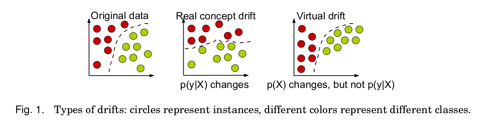
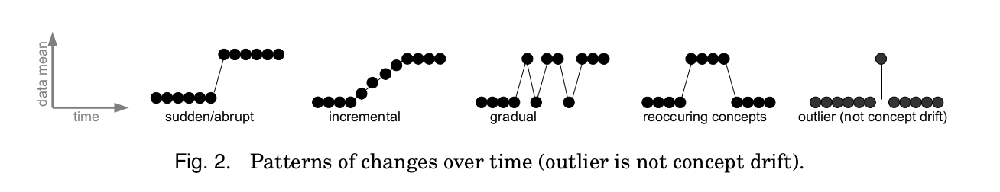

# Stream Learning Research Project

## About the project
The aim of this project is - in the light of new regulations concerning the right of individuals to request their personal data to be erased - to investigate the behavior of **Lazy Learning** Machine Learning algorithms - **k-nearest neighbors** models, in particular - on a **Stream Learning** setting, where data can be periodically erased from the models' memories.

## Environment installation
You need some python3 (preferable 3.8 or above) already installed.
To get the environment created:

	python3 -m venv "."

it will install locally all the python3 binaries and modules required and keep the environment separated from the rest of your system.  No root access will be required.
To install the dependencies:

	pip install -r requirements.txt

It will install scikit module and its dependencies for correct usage.

To run the first learning:

	cd lazy
	chmod +x generate_results_for_fgt_sam_knn.py
	./generate_results_for_fgt_sam_knn.py

## Stream Learning Setting
Unlike in **Batch Machine Learning**, where machine learning processes happen in a discrete fashion, in **Stream Machine Learning**, de data is processed in a continuous fashion. In this context, machine learning models have to cope with data coming in a sequential and possibly unlimited way. Therefore, in comparison with Batch Machine Learning, Stream Machine Learning requires models to operate under strict time and memory conditions.
## k-nearest neighbors
k-nearest neighbors is a pattern recognition method where input data is classified based on its distance to previously seen (and labeled) data points. Because previously seen data points are required for classification and the fact that memory is a concern in Stream Learning, **k-nearest neighbors in Stream Learning** is achieved by adding to it a **sliding window**, which stores a previously-chosen number of the most recent data points for every new input data.
## Concept Drift
Concept Drift refers basically to the phenomenom of data distribution changing over time, something very feasible in the context of Stream Learning.
There are 2 different concept drift types
* Real: Refers to changes in the distribution of the target variable with respect to the input data, even if the latter is unchanged.
* Virtual: Refers to changes in the input data without affecting the target variable distribution
**[1]**

Additionaly, changes may occur at a different pace and frequency over time, so time-related classifications also exist. These can be explained in the image below
**[1]**

## Experiments
### Framework
* The experiments were conduced using [scikit-multiflow](https://scikit-multiflow.github.io/), a Python Machine Learning on Data Streams framework.
* matplotlib was used for plot visualization.
### Datasets used
Initial experiments were conducted using 7 datasets, with different concept drift properties. 5 of are **artificial**, and 2 are **real-world** datasets:
#### Artificial
* [Interchanging RBF](https://github.com/vlosing/driftDatasets/tree/master/artificial/rbf) **[2]**
	* 200000 instances
	* Drift Properties:
		* Abrupt
		* Real
	* 2 classes
	* 10 features
* [Transient Chessboard](https://github.com/vlosing/driftDatasets/tree/master/artificial/chess) **[2]**
	* 200000 instances
	* Drift Properties:
		* Abrupt
		* Reoccurring
		* Virtual
	* 8 classes
	* 2 features
* [Moving Squares](https://github.com/vlosing/driftDatasets/tree/master/artificial/movingSquares) ([original source](http://users.rowan.edu/~polikar/research/nse/))
	* 200000 instances
	* Drift Properties:
		* Abrupt
		* Virtual
	* 2 classes
	* 10 features
#### Real World
* [Poker Hand](https://github.com/vlosing/driftDatasets/tree/master/realWorld/poker) ([original source](https://archive.ics.uci.edu/ml/datasets/Poker+Hand))
	* 829201 instances
	* Drift Properties:
		* Virtual
	* 10 classes
	* 10 features

#### All datasets used were retrieved from [Viktor Losing](https://github.com/vlosing)'s drift [datasets page](https://github.com/vlosing/driftDatasets).
### Evaluation
* ####  Metrics
	The only metric evaluated in these initial experiments was **Mean Accuracy**
* #### Method
	A typical Stream Learning evaluation method was used in these initial experiments, that is **Prequential Evaluation** or **Interleaved**-**Test**-**Then**-**Train Evaluation**
### Parameteres used
* **k** = 3, 5
* **window_size** = 5000

## Future work
In addition to the experiments conducted, there a few possibilities of other experiments:
* Conduct more experiments using [SAM-KNN](https://www.researchgate.net/publication/318830045_Self-Adjusting_Memory_How_to_Deal_with_Diverse_Drift_Types) **[3]** instead of KNN.
* Dropping the whole memory and starting it from scratch every time data is erased, and comparing this against the conducted experiments.
* Testing with erasing not only the most recent examples periodically, but also random examples.

## References
**1.** Gama, J., Žliobaitė, I., Bifet, A., Pechenizkiy, M., Bouchachia, A.: A survey on
concept drift adaptation. ACM Comput. Surv. 46(4) (2014)

**2.** V. Losing, B. Hammer and H. Wersing, "KNN Classifier with Self Adjusting Memory for Heterogeneous Concept Drift," 2016 IEEE 16th International Conference on Data Mining (ICDM), Barcelona, 2016, pp. 291-300, doi: 10.1109/ICDM.2016.0040.

**3.** Losing, Viktor & Hammer, Barbara & Wersing, Heiko. (2017). Self-Adjusting Memory: How to Deal with Diverse Drift Types. 4899-4903. 10.24963/ijcai.2017/690.
